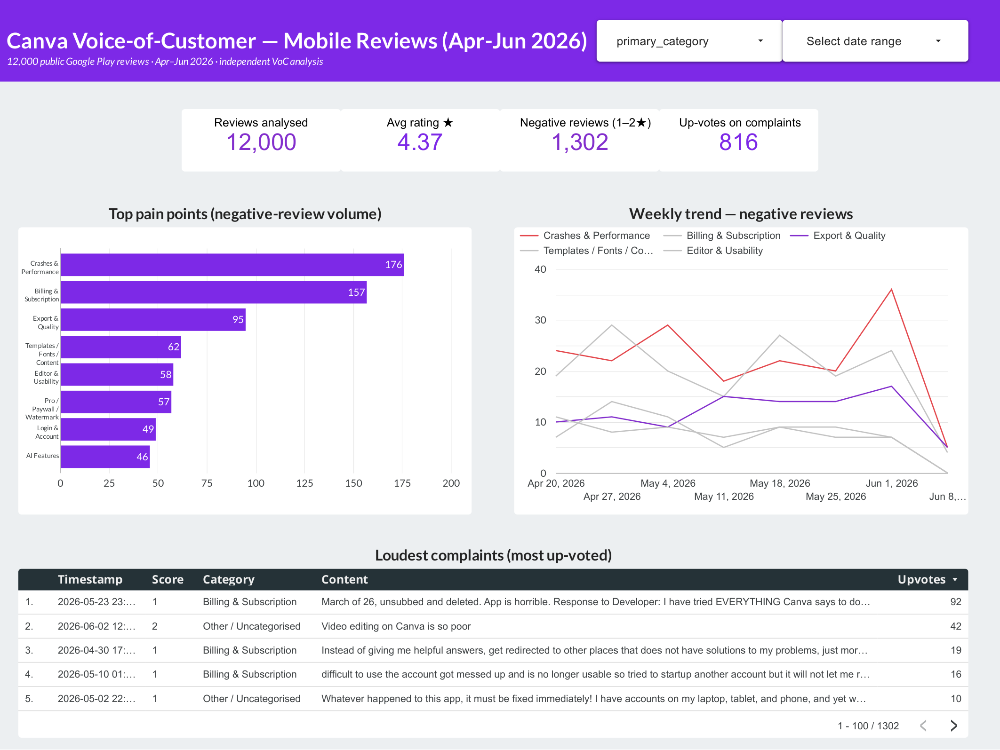
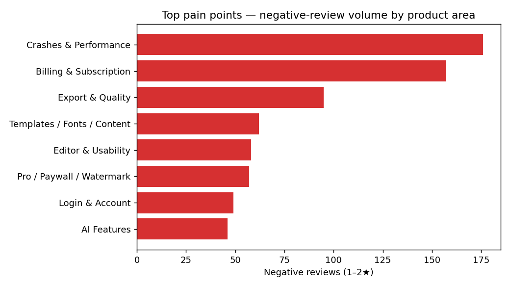
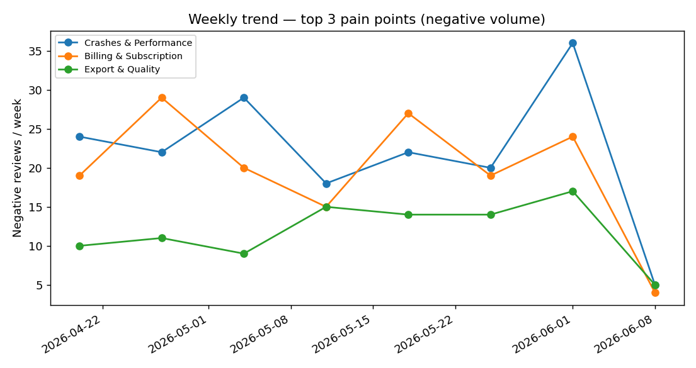

# Voice-of-Customer Analysis — Canva App Reviews

> A personal data project: an end-to-end pipeline that ingests real user reviews,
> classifies them into product areas, quantifies the top pain points, tracks which
> issues are *rising*, and turns it all into an insight brief and an interactive dashboard.

I wanted to see whether messy, free-text app-store feedback could be turned into the kind
of clear, prioritised insight a product team could actually act on. This project does that
end to end, on **12,000 real, public Google Play reviews of Canva** (21 Apr – 9 Jun 2026).

*Personal project. Uses only public data. Not affiliated with or endorsed by Canva.*



---

## TL;DR — what the feedback says

Canva's mobile reviews are overwhelmingly positive (**avg 4.37★, 84% positive, 5% neutral**), so
the signal lives in the **11% negative** reviews. Three product areas account for the
overwhelming majority of negative volume:

| Rank | Product area | Negative reviews | % of mentions that are negative | Avg ★ | User up-votes (reach) |
|---|---|---:|---:|---:|---:|
| 1 | **Crashes & Performance** | 176 | 57% | 2.35 | 269 |
| 2 | **Billing & Subscription** | 157 | 60% | 2.38 | **298** |
| 3 | **Export & Quality** | 95 | 51% | 2.61 | 103 |

**The one to watch:** *Export & Quality* negative volume is **up ~55% week-over-week** —
a small problem today that's trending the wrong way.




➡️ **Full write-up with recommendations: [`reports/insight_brief.md`](reports/insight_brief.md)**
➡️ **Live interactive dashboard: [Looker Studio →](https://lookerstudio.google.com/reporting/4a1a3ddc-4b06-4b32-9118-b61768640a6d)**

---

## The pipeline

```
  Google Play reviews ──► 01_scrape ──► 02_classify ──► 03_analyze ──► insight brief
                          (intake)      (taxonomy +     (quantify,      + dashboard
                                         theme discovery) trend, quotes)
```

| Stage | Script | What it does |
|---|---|---|
| **Intake** | `src/01_scrape_reviews.py` | Pulls the public review stream into `data/raw/` |
| **Classify** | `src/02_classify.py` | Multi-label **taxonomy** (12 product areas) + unsupervised **theme discovery** (TF-IDF → NMF) + star-based sentiment |
| **Analyze** | `src/03_analyze.py` | Top pain points, weekly trend / rising issues, representative verbatims, charts, dashboard extracts |

### How the classification works
- **Taxonomy (the auditable layer).** A maintained set of product areas (Billing,
  Crashes, Paywall, Login, Export, Usability, Ads, AI, …), each defined by transparent
  keyword rules. Reviews are tagged multi-label — one review can hit several areas.
- **Theme discovery (the let-the-data-speak layer).** NMF topic modelling over the
  negative reviews surfaces emerging themes the taxonomy might miss (see
  `reports/discovered_themes.txt`).
- **Sentiment.** Taken from the star rating (1–2 = Negative, 3 = Neutral, 4–5 = Positive)
  — a reliable built-in signal, no separate model required.

---

## Dashboard

**▶️ [View the live Looker Studio dashboard](https://lookerstudio.google.com/reporting/4a1a3ddc-4b06-4b32-9118-b61768640a6d)** — interactive: filter the complaints table, hover the trend lines.

The analysis exports flat files to [`dashboard/`](dashboard/) designed to plug straight
into **Looker Studio** (or Power BI). See [`dashboard/README.md`](dashboard/README.md)
for the one-click connection steps.

| File | Purpose |
|---|---|
| `category_summary.csv` | Volume, % negative, avg rating, reach per product area |
| `weekly_trend.csv` | Negative volume per area per week (the trend view) |
| `representative_quotes.csv` | Most up-voted verbatim per pain point |
| `reviews_negative.csv` | Full negative-review table for filtering/drill-down |
| `overview.csv` | Top-line KPIs — total reviews, avg rating, % negative |

---

## Run it yourself

```bash
pip install -r requirements.txt
python src/01_scrape_reviews.py   # ~12k reviews → data/raw/
python src/02_classify.py         # → data/processed/ + discovered themes
python src/03_analyze.py          # → figures + dashboard extracts + findings
```

---

## Data & ethics
- Source: public Google Play reviews via the `google-play-scraper` package.
- Usernames are **not** stored — only an anonymous review id, rating, date, up-votes and text.
- This is an independent analysis for learning/portfolio purposes, **not** affiliated with Canva.

## Honest limitations
- **Segment:** Play Store reviews skew toward **individual / mobile / free-tier** users —
  not enterprise/business users. The same method would apply to other segments given the
  right feedback source.
- **Channel:** one channel (Play Store). A production version would unify support tickets,
  surveys, and social.
- **Point-in-time:** a ~7-week window; trends are indicative, not seasonal.
- **Keyword taxonomy** will miss paraphrases; the NMF layer partly compensates and the
  rules are easy to extend.
- **Rating–text mismatch:** ~25% of 1–2★ reviews are short rating–text mismatches
  (e.g. a 1★ review whose entire text is just "good"). Star rating is used as the
  sentiment signal; genuine complaints are multi-labelled to their product area, so
  they still surface in the right bar.

---

## What this project demonstrates
A compact but complete analytics workflow:
- **Pipeline design** — ingest → classify → analyse → report, as reproducible scripts
- **NLP** — multi-label keyword taxonomy + unsupervised NMF topic modelling
- **From qualitative to quantified** — turning free-text reviews into ranked, sized pain points
- **Trend detection** — week-over-week movement to catch rising issues
- **BI dashboarding** — a Looker Studio dashboard built for a non-technical audience
- **Honest data-quality handling** — star-rating sentiment, multi-label overlap, the rating–text mismatch caveat

## Repo structure
```
src/        scrape → classify → analyze
reports/    insight_brief.md, discovered_themes.txt, figures/
dashboard/  CSV extracts + Looker Studio guide
data/       raw + processed (regenerated by the scripts; git-ignored)
```
